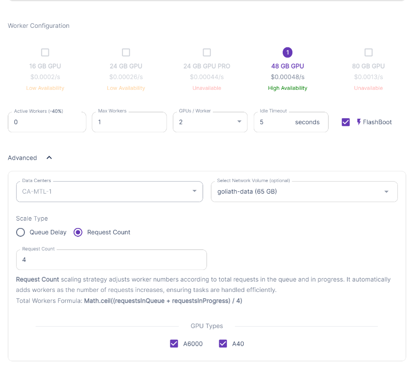

# Guide for Creating a Serverless LLM Endpoint for Goliath-longLORA-120b-rope8-32k-fp16-AWQ

Configuration for this model [TheBloke/Goliath-longLORA-120b-rope8-32k-fp16-AWQ](https://huggingface.co/TheBloke/Goliath-longLORA-120b-rope8-32k-fp16-AWQ) is nearly identical to the one I use in the [MiquMaid](./miqumaid_guide.md). So I will only highlight the differences here.

**Note**: There's probably enough available vram with this setup to use a larger `MAX_MODEL_LENGTH` and context size within ST, but I haven't tested anything higher than `8192`.

## Pre-download Model

Follow the instructions provided in [hf-pre-downloader](./hf_pre_downloader.md) guide to load the model in the network volume before creating the endpoint. This will save on execution time.

I use a network volume with a size of `65 gb`.

## Endpoint Configuration




Here are the template configuration values:

| Parameter | Value |
|-----------|-------|
| `MODEL_NAME` | `TheBloke/Goliath-longLORA-120b-rope8-32k-fp16-AWQ` |
| `QUANTIZATION` | `awq` |
| `CUSTOM_CHAT_TEMPLATE` | See code block below |
| `MAX_MODEL_LENGTH` | `8192` |
| `ENFORCE_EAGER` | `1` |
| `TRUST_REMOTE_CODE` | `1` |
| `DISABLE_LOG_REQUESTS` | `1` |
| `GPU_MEMORY_UTILIZATION` | `0.98` |
| `TENSOR_PARALLEL_SIZE` | `2` |

Chat template:
```markdown
{{message['role']|upper + ':' + '\n' + message['content'] + '\n'}}\nASSISTANT:\n
```

## See MiquMaid guide for ST and Server settings

The server and ST settings I use for this goliath model are identical to the ones I use for [MiquMaid](./miqumaid_guide.md).